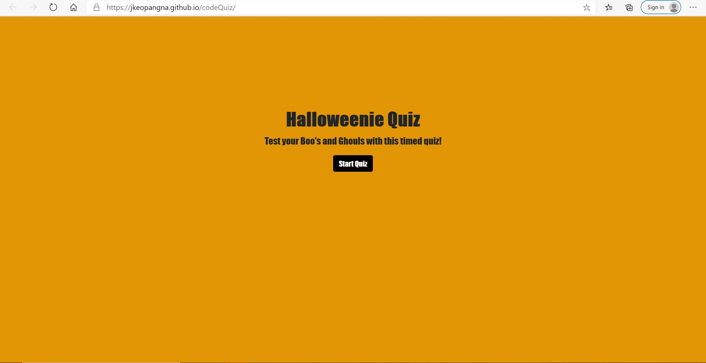

# codeQuiz

HW4: Halloween Code Quiz

The purpose of this quiz application provides a better understanding of what a future full-stack web developer can experience during an interview process. The process would involve a coding assessment which can consist a combination of multiple-choice questions and interactive coding challenges.

To familiarize oneself with these types of processes, a timed coding quiz with multiple choice questions is developed. The skills obtained thus far are applied to the application creating HTML, CSS and Javascript elements. In return, the quiz performs the following:

    1. Start button to begin the quiz and start the timer
    2. Multiple choice questions that if answered incorrectly, deducts time from the timer countdown
    3. Submit and track scores using local storage

Link and image are provided below to preview the finished application.

[link](https://jkeopangna.github.io/codeQuiz/ "Halloweenie Quiz")

